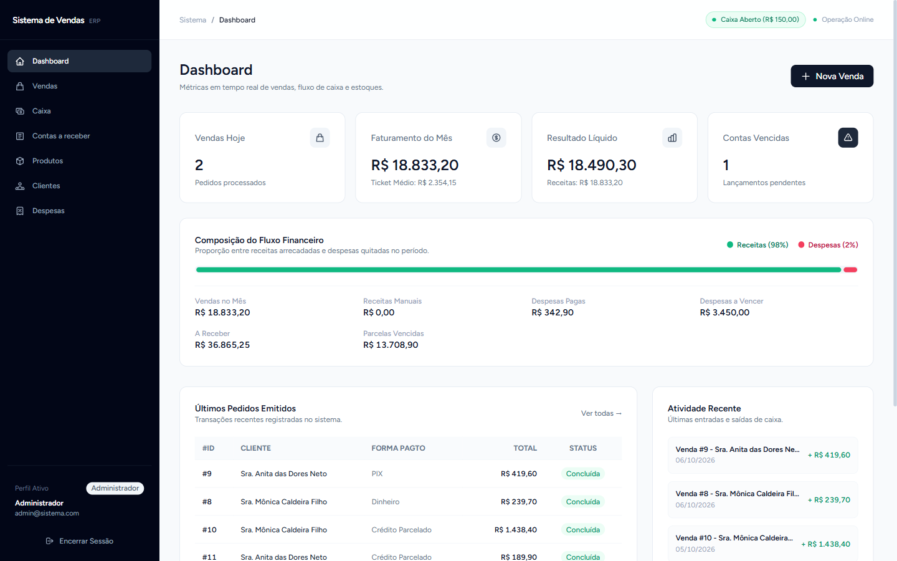
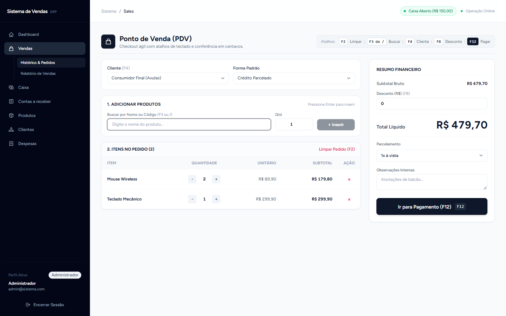
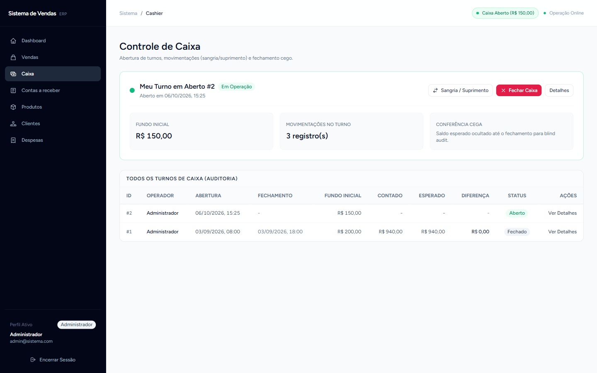
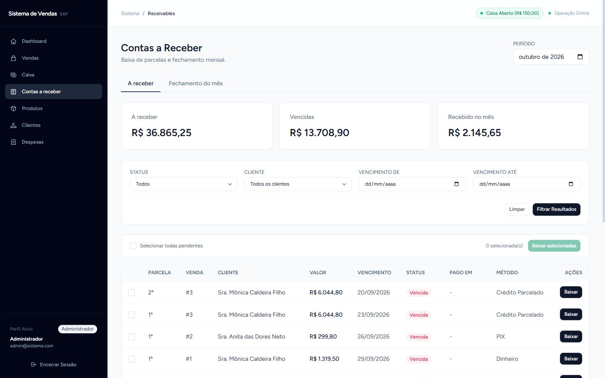
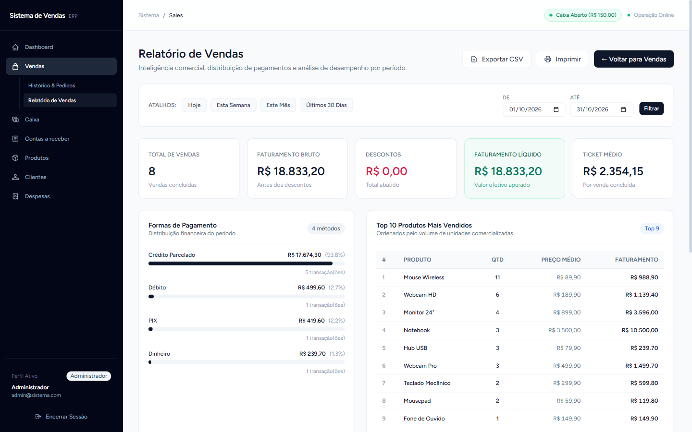

<div align="center">

# Sistema de Vendas

**Aplicação ERP para gestão de vendas, estoque, clientes e finanças**

[](https://github.com/davigasperin/sistema-vendas/actions/workflows/ci.yml)
[](https://www.php.net/)
[](https://laravel.com/)
[](https://vuejs.org/)
[](https://www.typescriptlang.org/)
[](LICENSE)

</div>

---

## Sobre o Projeto

Sistema completo de gerenciamento de vendas desenvolvido para operações reais de pequenos e médios negócios. Resolve o problema de controle manual de vendas, estoque desatualizado e falta de visibilidade financeira — substituindo planilhas por uma aplicação web com autoridade total do backend sobre preços, estoque concorrente travado e parcelamento sem perda de centavos.

<p align="center">
  
</p>

<table align="center">
  <tr>
    <td align="center" width="50%">
      <a href="docs/screenshots/pdv.png">
        <br>
        <sub><b>PDV</b> — checkout ágil, pagamento dividido e troco</sub>
      </a>
    </td>
    <td align="center" width="50%">
      <a href="docs/screenshots/caixa.png">
        <br>
        <sub><b>Caixa</b> — turnos, sangria/suprimento e fechamento cego</sub>
      </a>
    </td>
  </tr>
  <tr>
    <td align="center" width="50%">
      <a href="docs/screenshots/contas-a-receber.png">
        <br>
        <sub><b>Contas a receber</b> — baixa de parcelas e fechamento mensal</sub>
      </a>
    </td>
    <td align="center" width="50%">
      <a href="docs/screenshots/relatorio-vendas.png">
        <br>
        <sub><b>Relatórios</b> — pagamentos, produtos e vendedores</sub>
      </a>
    </td>
  </tr>
</table>

## Funcionalidades

| Módulo | Capabilities |
|--------|-------------|
| **PDV** | Checkout ágil com atalhos de teclado, pagamento dividido (split), cálculo de troco em centavos, cupom térmico |
| **Vendas** | Registro atômico, cálculo de preço pelo servidor, múltiplas formas de pagamento, cancelamento com estorno de estoque |
| **Parcelamento** | Divisão exata em centavos, controle de vencimentos, quitação individual, proteção contra cancelamento com parcelas pagas |
| **Contas a Receber** | Baixa total unitária e em lote (transação única), recebimento em dinheiro entra no caixa, filtros por status/cliente/vencimento |
| **Caixa** | Ciclo completo de turnos, sangria e suprimento, fechamento cego (blind close), conferência esperado × contado |
| **Fechamento Mensal** | Congelamento do período com totais auditáveis; bloqueia baixas e movimentações retroativas com lock contábil |
| **Estoque** | Decremento transacional com `lockForUpdate`, movimentações auditáveis, alerta de estoque baixo, ajuste manual |
| **Clientes** | Cadastro completo, histórico de compras, busca por nome/email/telefone |
| **Despesas** | Contas a pagar, receitas manuais, categorias coloridas, relatório financeiro com balanço |
| **Dashboard** | Faturamento do mês, ticket médio, balanço líquido, somas de parcelas a receber/vencidas, fluxo financeiro, últimas vendas |
| **Relatórios** | Relatório analítico de vendas (pagamentos, top produtos, vendedores, série diária), export CSV e PDF via DomPDF |
| **API REST** | Endpoints versionados `/api/v1`, autenticação Sanctum, rate limiting, respostas padronizadas |
| **RBAC** | Roles `admin`, `seller`, `financial` com políticas granulares por recurso |

## Arquitetura

```
app/
├── Actions/              # Casos de uso transacionais
│   ├── CreateSaleAction          # Backend price authority + lockForUpdate
│   ├── UpdateSaleAction          # Restauração atômica de estoque
│   ├── CancelSaleAction          # Estorno + cancelamento de parcelas
│   ├── GenerateInstallmentsAction  # Distribuição exata de centavos
│   ├── OpenCashShiftAction / AddCashMovementAction / CloseCashShiftAction
│   ├── PaySaleInstallmentAction  # Baixa de parcela + movimento Receipt no caixa
│   └── CloseMonthAction          # Congelamento do período contábil
├── DTOs/                 # Transporte imutável tipado
├── Enums/                # PHP 8.2 Backed Enums (SaleStatus, UserRole...)
├── Exceptions/Domain/    # Exceções de domínio tipadas
├── Http/
│   ├── Controllers/
│   │   ├── Web/              # Inertia + Vue 3
│   │   └── Api/V1/           # JSON REST + Sanctum
│   ├── Requests/         # Validação estrutural
│   ├── Resources/V1/     # JsonResource padronizado
│   └── Middleware/        # HandleInertiaRequests, SecurityHeaders
├── Models/               # Eloquent com casts de Enum e relações tipadas
├── Policies/             # Autorização por recurso (authorizeResource)
├── Queries/              # Agregações no banco (DashboardMetrics, SalesReport, Receivables)
└── Services/             # Domain services reutilizáveis

resources/js/
├── app.ts                # Entry Inertia + Vue 3 + TypeScript
├── Components/UI/        # StatCard, Badge, Modal, Pagination, Toast, ConfirmDialog...
├── Layouts/              # AppLayout (Sidebar responsiva)
├── Pages/                # 25 páginas Vue Composition API (Dashboard, Sales, Cashier,
│                         # Receivables, Products, Customers, Expenses, Auth)
└── types/                # Interfaces TypeScript

compose.yaml              # Docker Sail (PHP 8.4, MySQL 8.4, Redis)
```

**Princípios:**
- Backend é a autoridade única sobre preços, totais e estoque
- Transações atômicas com `DB::transaction()` + `lockForUpdate()`
- Valores monetários calculados em centavos inteiros
- Enums tipados eliminando magic strings
- Políticas de autorização aplicadas via `authorizeResource()`
- Período contábil congelado com lock de linha única (`accounting_period_locks`)

## Stack Tecnológica

| Camada | Tecnologia |
|--------|-----------|
| **Backend** | Laravel 12, PHP 8.2+ |
| **Frontend** | Vue 3 (Composition API), TypeScript strict, Inertia.js |
| **Estilos** | TailwindCSS 4 |
| **Banco** | MySQL 8.4 (dev local também usa SQLite) |
| **Cache/Queue** | Redis (opcional), Database |
| **Auth** | Laravel Breeze (web) + Sanctum (API) |
| **Build** | Vite 7 |
| **Testes** | PHPUnit (128 testes, 647 assertions) |
| **Análise** | PHPStan/Larastan (nível 5), Laravel Pint, ESLint |
| **Docker** | Laravel Sail (PHP 8.4, MySQL, Redis) |
| **CI** | GitHub Actions (Pint, PHPStan, PHPUnit, vue-tsc, build) |

## Instalação

### Opção A — Docker (recomendado)

```bash
git clone https://github.com/davigasperin/sistema-vendas.git
cd sistema-vendas

# Subir containers (PHP, MySQL, Redis)
./vendor/bin/sail up -d

# Instalar dependências e configurar
composer install
npm install
cp .env.example .env
./vendor/bin/sail artisan key:generate
./vendor/bin/sail artisan migrate --seed
npm run build

# Acessar
open http://localhost
```

### Opção B — Local (sem Docker)

```bash
git clone https://github.com/davigasperin/sistema-vendas.git
cd sistema-vendas

composer install && npm install
cp .env.example .env
php artisan key:generate
php artisan migrate --seed
npm run build
php artisan serve
```

Acesse `http://localhost:8000`.

> **Windows:** em um segundo terminal, suba o Vite com `npm run dev -- --host 127.0.0.1` para o HMR apontar para uma URL válida (`public/hot`).

## Testes

```bash
php artisan test                    # 128 testes, 647 assertions
./vendor/bin/pint --test            # Code style PSR-12
./vendor/bin/phpstan analyse        # Static analysis nível 5
npx vue-tsc --noEmit                # TypeScript strict
npx eslint resources/js             # Lint do frontend
npm run build                       # Build de produção
```

## API REST

Base URL: `http://localhost/api/v1`

```bash
# Autenticação
POST /api/v1/login
GET  /api/v1/me

# Produtos
GET    /api/v1/products
GET    /api/v1/products/{id}
POST   /api/v1/products
PATCH  /api/v1/products/{id}/adjust-stock
GET    /api/v1/products/search?q=

# Clientes
GET   /api/v1/customers
POST  /api/v1/customers
GET   /api/v1/customers/search?q=

# Vendas
GET  /api/v1/sales
POST /api/v1/sales
POST /api/v1/sales/{id}/cancel

# Parcelas
PATCH /api/v1/installments/{id}/mark-paid

# Despesas
GET    /api/v1/expenses
POST   /api/v1/expenses
PATCH  /api/v1/expenses/{id}/mark-paid
```

Documentação completa em [`docs/API.md`](docs/API.md).

## Decisões Técnicas

| Decisão | Justificativa | ADR |
|---------|--------------|-----|
| Backend price authority | Frontend nunca envia preço confiável; servidor busca `product.price` com `lockForUpdate` | [003](docs/DECISIONS/003-stock-concurrency.md) |
| Centavos inteiros | Evita perda de precisão float em parcelas (R$100/3 ≠ 3×R$33,33) | [002](docs/DECISIONS/002-money-handling.md) |
| Inertia + Vue | SPA sem API interna desnecessária; Laravel mantém controle de rotas e auth | [001](docs/DECISIONS/001-inertia-vue.md) |
| API versionada /v1 | Compatibilidade retroativa; mudanças breaking em `/v2` | [004](docs/DECISIONS/004-api-versioning.md) |
| Enums PHP 8.2+ | Elimina magic strings; refatoração segura com verificação de tipos | — |
| Query Objects | Agregações complexas fora de Models/Services; testáveis isoladamente | — |
| Fechamento cego | Operador não vê o esperado no fechamento; auditoria preserva o blind close | — |
| Período contábil congelado | Linha de lock única por execução serializa baixa, venda e fechamento mensal | — |

## Roadmap

| Fase | Status |
|------|--------|
| 1. Characterization (factories, testes) | Concluída |
| 2. Backend Foundation (enums, migrations, policies) | Concluída |
| 3. Sales + Stock (transações, lock, cancelamento) | Concluída |
| 4. Expenses + Dashboard (query objects, N+1) | Concluída |
| 5. API V1 (Sanctum, resources, documentação) | Concluída |
| 6. Vue 3 + Inertia (25 páginas, TypeScript) | Concluída |
| 7. Docker + CI (Sail, GitHub Actions) | Concluída |
| 8. Portfolio (README, ADRs, docs) | Concluída |
| 9. PDV + Caixa (split payments, troco, cupom térmico, blind close) | Concluída |
| 10. Contas a receber + fechamento mensal (baixa unitária/lote, guarda contábil) | Concluída |

Roadmap detalhado em [`docs/ROADMAP.md`](docs/ROADMAP.md).

## Estrutura de Testes

```
tests/Feature/
├── Api/                    # 6 testes de endpoints REST (inclui baixa de parcela)
├── Auth/                   # 6 testes de autenticação Breeze
├── CashShift/              # 2 testes de ciclo de caixa e fechamento cego
├── Customers/              # 1 teste de CRUD
├── Dashboard/              # 1 teste de métricas e somas
├── Expenses/               # 2 testes de despesas
├── Products/               # 1 teste de produtos
├── Receivables/            # 1 teste de baixa, lote, guarda de mês fechado
├── Sales/                  # 3 testes de vendas e ciclo de vida
├── AuthorizationTest.php   # RBAC por role
├── FactorySmokeTest.php    # Integridade de factories
└── ProfileTest.php         # Perfil de usuário
```

Total: **128 testes, 647 assertions**.

## Documentação

- [`docs/ARCHITECTURE.md`](docs/ARCHITECTURE.md) — Arquitetura e princípios de design
- [`docs/ROADMAP.md`](docs/ROADMAP.md) — Plano incremental de execução
- [`docs/API.md`](docs/API.md) — Documentação da API REST v1
- [`docs/DECISIONS/`](docs/DECISIONS/) — Architecture Decision Records

## Licença

MIT License. Veja [`LICENSE`](LICENSE) para detalhes.
